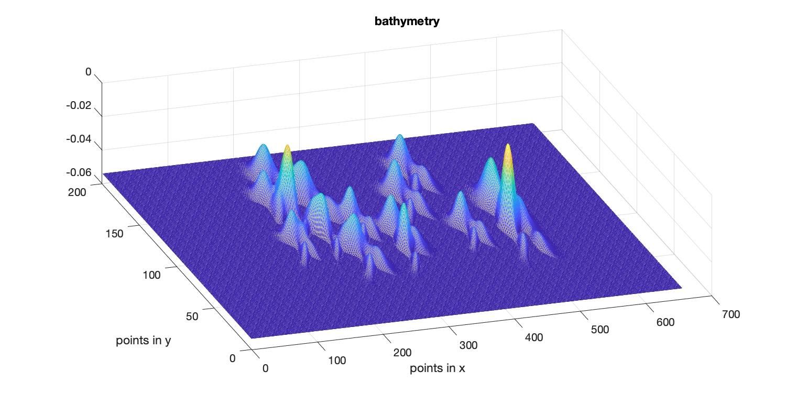

bathymetry with random distribution of rocks 
------------------------------------------------

.. toctree::
   :maxdepth: 2

In /ibm_lg_domain/ (Git repository)

1) use mk\_1_random\_bathy.m to generate a flat bottom with random distribution of rocks as shown in the figure above. 

2) use mk\_2_obstacle\_files.m to get the obstacle input file: obs\_mask.txt. Note, the matlab program doesn't generate values of Rx, Ry and Rz. **You should set  OBS\_Require\_Rxyz= F in input.txt**

3) set up input.txt (same as lloyd case except the following changes)

  .. code-block:: rest  

     ! cell numbers
     Mglob = 656
     Nglob = 200
     Kglob = 30

     ! --------------------OBSTACLE (IBM) ---------------------------
     OBS_Require_Rxyz= F
     OBS_MASK_FILE = obs_mask.txt

4) post-processing can be done using plot\_3d\_data.m in the current folder.

  .. figure:: images/vort_00220.png
    :align: center
    :alt: alternate text
    :figclass: align-center

