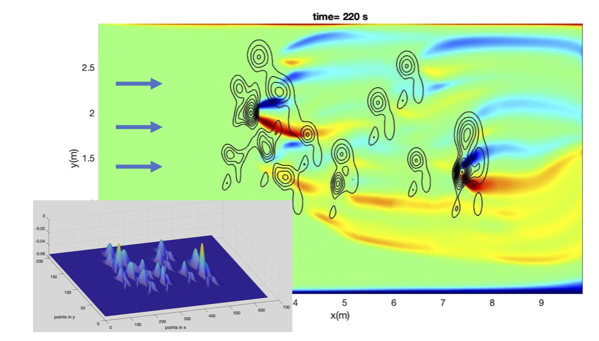

.. nhwave_wiki documentation master file, created by
   sphinx-quickstart on Sun Apr 24 13:52:16 2022.
   You can adapt this file completely to your liking, but it should at least
   contain the root `toctree` directive.

NHWAVE Immersed Boundary Method in s-coordinate
=================================================================================

NOTE: This page provides info about the development of the IBM module and s-coordinate.  
Some contents will merge into NHWAVE (Kirby's) GIT Repository and future WIKI page.

.. toctree::
   :maxdepth: 3

   code
   method
   examples

Indices and tables
==================

* :ref:`genindex`
* :ref:`modindex`
* :ref:`search`
