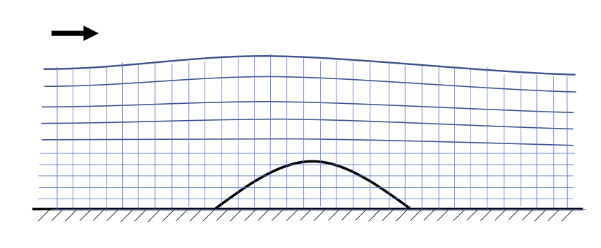
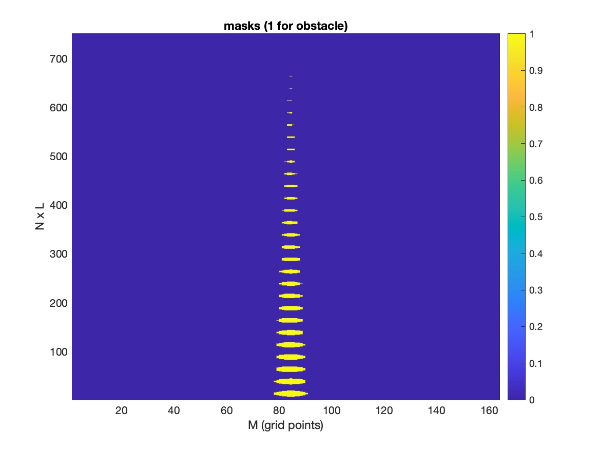
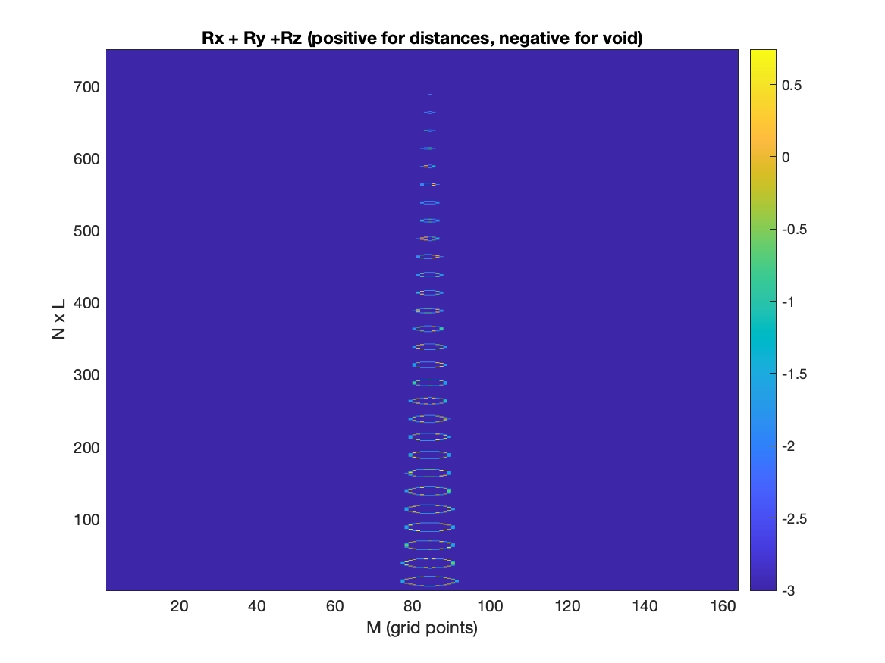

Pre-processing
=====================================

.. toctree::
   :maxdepth: 2

.. toctree::
   :maxdepth: 2

An example for preprocessing is in /lloyd\_ibm\_coarse\_grid/ (Git repository). It's the case of Lloyd experiment using very coarse grid (0.06 x0.06 m). Model setup:

  .. code-block:: rest  
 
     ! cell numbers
      Mglob = 164
      Nglob = 25
      Kglob = 30

     ! grid sizes
      DX = 0.06
      DY = 0.06

This figure is only for demonstration. For the steady state case, we don't bother using the new s-coordinate

In /lloyd\_ibm\_coarse\_grid/, use mk\_obstacle.m to generate three files: obs\_mask.txt, obs\_rx.txt and obs\_ry.txt, which are input files of the model. 

To check if the generated files are correct, check the figures:

Masks of Lloyd case. Note: the y-axis is N-dimension x L-levels.  

Rx + Ry + Rz of Lloyd case. Check the sum (Rx, Ry, Rz) makes closed circles.  

