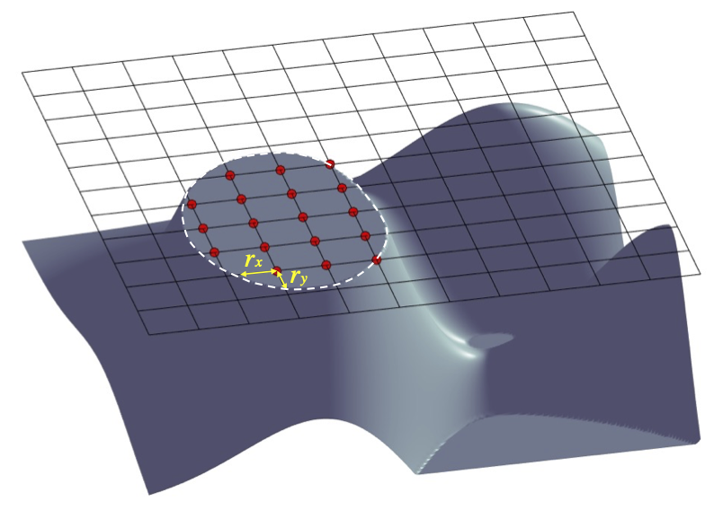

Representation of 3D geometry of obstacles 
======================================================

.. toctree::
   :maxdepth: 2

Configuration of 3D object surface. Red points represent solid object masks at a vertical level s. The masks at the surface boundary have two parameters (:math:`r_x, r_y`), representing distances to the boundary (white line) in :math:`x` and :math:`y`, respectively. Model input is through the so-called obstacle files, including masks, :math:`r_x` and :math:`r_y`. Values of (:math:`r_x, r_y`) are optional. If users do not provide (:math:`r_x, r_y`) the default (:math:`r_x, r_y`) = :math:`0`.